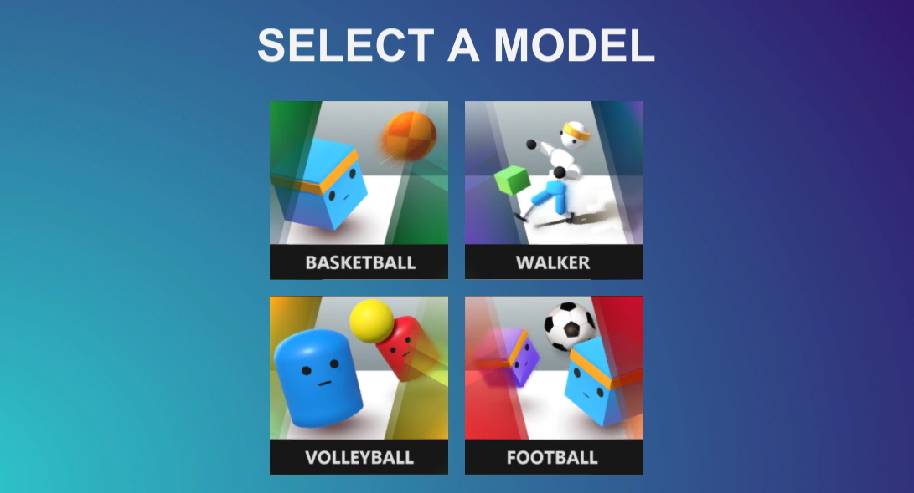
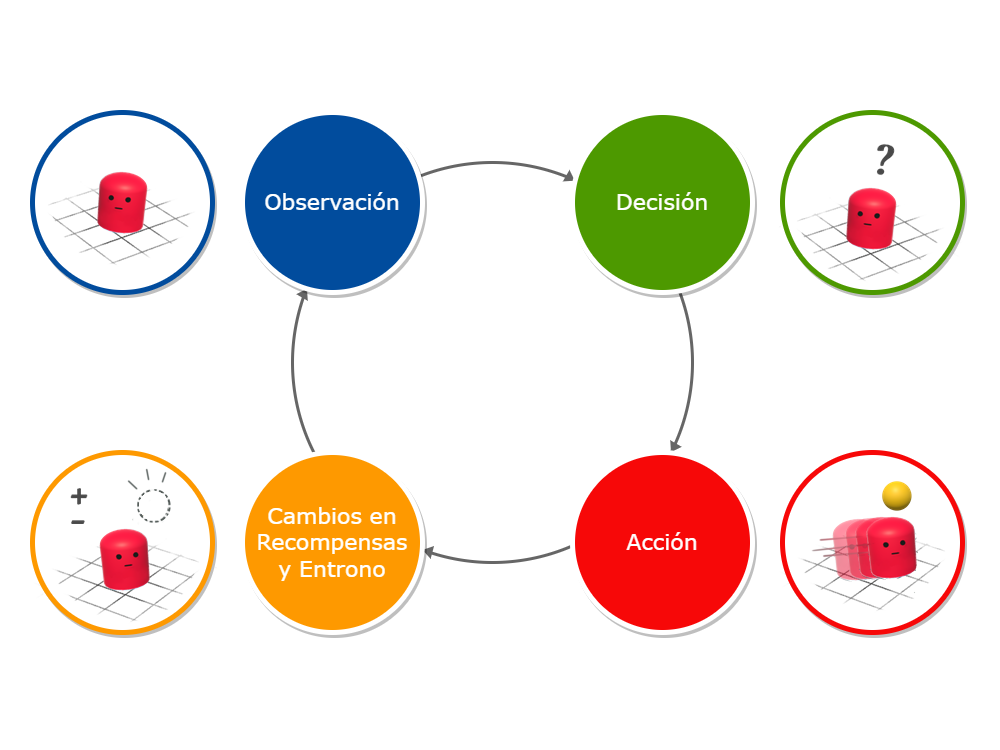
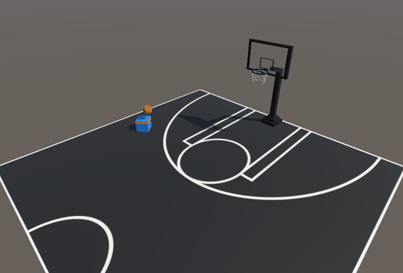
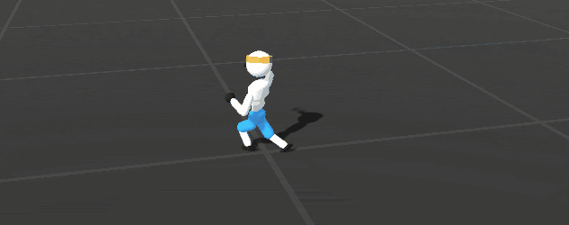

[](https://github.com/jmdieguez/unity-ai/blob/master/README-en.md)
[](https://github.com/jmdieguez/unity-ai/blob/master/README.md)
[](https://github.com/jmdieguez/unity-ai/blob/master/README-pt-br.md)

# Artificial Intelligence FIUBA

Training AI models with reinforcement learning 3D project in Unity. It corresponds to the group practical work of the course **ARTIFICIAL INTELLIGENCE (95.25)** at the Faculty of Engineering of the University of Buenos Aires (**FIUBA**).





## About the Project
---


### Introduction
The idea of the project was to create two new examples of relatively simple environments and refine or improve two of the examples provided by the ML-Agents team in the toolkit (four examples in total), in order to cover more aspects of the subject while keeping it manageable. This approach was chosen because the group had no previous experience in the Unity environment, nor in reinforcement learning.


### Reinforcement Learning
Reinforcement learning is a teaching technique that involves rewarding positive behaviors and punishing negative ones. It consists of empirical learning, so the computer agent is constantly searching for those decisions that reward it and avoids those paths that, based on its own experience, are penalized.



### Some concepts:

- **Agent**: The entity that learns and makes decisions.

- **Environment**: The context in which the agent interacts and receives feedback.

- **Observations**: The different elements that make up the environment. They correspond to the input layer of the neural network.

- **Actions**: The options that the agent can take in response to the observations of the environment. It corresponds to the output layer of the neural network.

- **Rewards**: The positive or negative feedback that the agent receives for its actions.


### Basketball

This is a simple example created from scratch where the agent learns only within the environment, that is, with a limited set of observations and actions, it tries to score a basketball into a hoop, it is rewarded if it succeeds, and also penalized under certain conditions to achieve the desired behavior more quickly.


Start             |  Final Result
:-------------------------:|:-------------------------:
|<p float=left align="middle"></p>  | <p float=left align="middle"></p>|


### Walker
Again, an example of an agent that learns only in the environment, in this case, it is an example provided by the Unity ML-Agents toolkit that we sought to improve. The focus was on achieving a more human-like walking behavior for the agent, which was an iterative process with various tests to finally achieve a satisfactory result.


Start             |  Final Result
:-------------------------:|:-------------------------:
|<p float=left align="middle"></p>  | <p float=left align="middle"></p>|


### Volleyball
This example was also created from scratch, with the aim of covering the training of agent vs. agent, where they learn by playing against each other. Various problems arose in achieving the desired behavior, as the agents maximized their rewards by exploiting unforeseen situations, but the expected result was finally achieved with a wide range of rewards.


Start             |  Final Result
:-------------------------:|:-------------------------:
|<p float=left align="middle"></p>  | <p float=left align="middle"></p>|


### Soccer
Finally, this example seeks to explore the learning of agents vs. agents, that is, by groups of agents playing with each other as a team. Once again, we worked on an example provided in the toolkit, it consisted of two teams of two agents. This was expanded to six agents per team and agents with different positions on the court (for example: goalkeeper) were introduced, and therefore different behaviors. The end result was achieved with a complex reward set relative to the others.


Start             |  Final Result
:-------------------------:|:-------------------------:
|<p float=left align="middle"></p>  | <p float=left align="middle"></p>|

## Used frameworks
---


### Unity ML-Agents
To develop the work we use [**ML-Agents**](https://unity-technologies.github.io/ml-agents/), a reinforcement learning framework developed by [Unity Technologies](https:// store.unity.com/download) that allows developers of games and other simulation environments to train artificial intelligence (AI) agents in virtual environments.

### TensorBoard
For the visualization of training over time we use **TensorBoard**, the toolkit developed by TensorFlow. Within the application you can analyze the training statistics as well as the change of the models policy over time. To run TensorBoard, use:

```bash
$ tensorboard --logdir results
```

Where **results** is the folder generated by ML-Agents with the respective neural network models.

### PyTorch
**PyTorch** is an open source library for performing computations using data flow graphs, the fundamental way to represent deep learning models. Many of the **Unity ML-Agents** toolkit models are implemented on top of this library.

## Dependencies

- Python (3.8.13 or higher)
- Unity (2021.3 or later)
- Unity package com.unity.ml-agents
- Unity package com.unity.ml-agents.extensions


```
$ python -m pip install mlagents==0.30.0
```
```bash
$ pip3 install torch~=1.7.1 -f https://download.pytorch.org/whl/torch_stable.html
```

```bash
$ pip3 install tensorboard
```


## Training
---


With the exception of the Soccer example, which uses **MA-POCA** because it is learning in groups, the others make use of the algorithm developed by OpenAI, **PPO** (Proximate Policy Optimization), the same is a technique that uses a neural network to approximate the ideal function that maps an agent's observations to the best action that an agent can perform in a given state.
This is an iterative process in which we train, visualize the training metrics, and adjust hyperparameters accordingly.

### Some metrics of interest:


| Variable | Description |
| ----------- | ----------- |
| **entropy** | Uncertainty measure. This corresponds to how random an agent's decisions are.|
| **beta** | It corresponds to the strength of the entropy regularization, which makes the policy "more random". This ensures that agents properly explore the action space during training.|
| **gamma** | Discount factor for future rewards. This can be thought of as how far into the future the agent should be concerned with possible rewards. In situations where the agent should be acting in the present to prepare for rewards in the far future, this value should be large. In cases where the rewards are more immediate, it may be less.|
| **epsilon** | Acceptable threshold for divergence between old and new policy during gradient-down update. Setting this value to a small value will result in more stable updates, but will also slow down the training process.
| **buffer_size** | How many experiences (agent observations, actions, and earned rewards) should be collected before any model learning or update is done. Too high a value can impair training |
| **batch_size** | The number of experiences used for one iteration of a gradient descent update. This should always be a fraction of the **buffer_size** |
| **learning_rate** | Force each step of gradient descent update.|
| **num_layers** | How many hidden layers are present after the observation input.|
| **hidden_units** | How many units are in each fully connected layer of the neural network.|
| **max_steps** | How many steps of the simulation will the training last. For more complex problems the number should be raised.|

### An example file:

    behaviors:
      Walker:
        trainer_type: ppo
        hyperparameters:
          batch_size: 2048 //
          buffer_size: 20480
          learning_rate: 0.0003
          beta: 0.005
          epsilon: 0.2
          lambd: 0.95
          epoch_num: 3
          learning_rate_schedule: linear
        network_settings:
          normalize: true
          hidden_units: 512
          num_layers: 3
          vis_encode_type: simple
        reward_signals:
          extrinsic:
            gamma: 0.995
            strength: 1.0
        keep_checkpoints: 5
        max_steps: 30000000
        time_horizon: 1000
        summary_freq: 30000

To start a training session, all you have to do is have the scene open in Unity with the agent you want to train and run:

    mlagents-learn <path to configuration file> --run-id= <unique id of neural network model>

The following flags can be used:

- --resume : Resume a training session for a given id.
- --force : Overwrite an id.
- --initialize-from= : Start a training session for a new id from a pretrained model.

## More information
---


- [Reinforcement Learning](https://huggingface.co/tasks/reinforcement-learning)

- [Example Learning Environments](https://github.com/Unity-Technologies/ml-agents/blob/develop/docs/Learning-Environment-Examples.md)

- [Installation & Set-up](https://github.com/miyamotok0105/unity-ml-agents/blob/master/docs/Installation.md)

- [Training with Proximal Policy Optimization](https://github.com/miyamotok0105/unity-ml-agents/blob/master/docs/Training-PPO.md)

- [Training Configuration File](https://github.com/Unity-Technologies/ml-agents/blob/develop/docs/Training-Configuration-File.md)

- [Training intelligent adversaries using self-play with ML-Agents](https://blog.unity.com/technology/training-intelligent-adversaries-using-self-play-with-ml-agents)

- [Training In Cooperative Multi-Agent Environments with MA-POCA](https://github.com/Unity-Technologies/ml-agents/blob/develop/docs/ML-Agents-Overview.md#training-in-cooperative-multi-agent-environments-with-ma-poca)

- [Using TensorBoard to Observe Training](https://github.com/Unity-Technologies/ml-agents/blob/develop/docs/Using-Tensorboard.md#using-tensorboard-to-observe-training)


## Authors
---


- [Manuel Dieguez](https://github.com/jmdieguez)

- [Tomas Della Vecchia](https://github.com/tomdv18)

- [James Marczewski](https://github.com/smarczewski)

- [Ignacio Montecalvo](https://github.com/imontecalvo)


## Acknowledgments
---


- Some of the examples provided in [Unity ML-Agents Toolkit](https://github.com/Unity-Technologies/ml-agents) were used as a base.

- For the Basketball environment, a modified version of [Basketball hoop](https://skfb.ly/oxFvs) by [hotdoghans](https://sketchfab.com/hotdoghans) was used under license [CC BY 4.0]( https://creativecommons.org/licenses/by/4.0/).

- For the background of the menu an [image](https://unsplash.com/en/photos/pJadQetzTkI) of [Luke Chesser](https://unsplash.com/@lukechesser?utm_source=unsplash&utm_medium=referral&utm_content=) was used.
