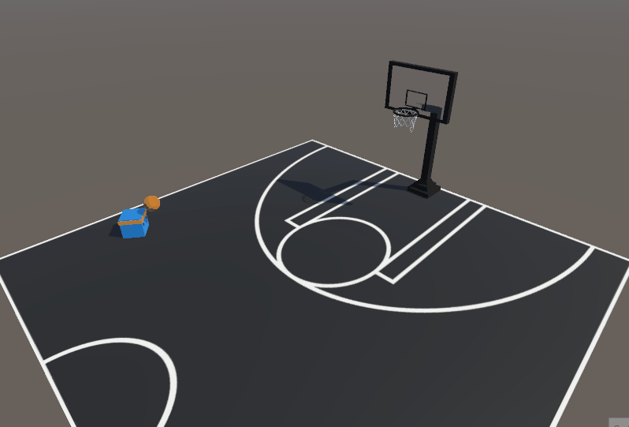

[](https://github.com/jmdieguez/unity-ai/blob/master/README-en.md)
[](https://github.com/jmdieguez/unity-ai/blob/master/README.md)
[](https://github.com/jmdieguez/unity-ai/blob/master/README-pt-br.md)

# Trabalho Prático em Grupo - Inteligência Artificial FIUBA

Projeto de treinamento de modelo de IA com Reinforcement Learning (**Reinforcement Learning**) no Unity. Corresponde ao trabalho prático em grupo da disciplina **INTELIGÊNCIA ARTIFICIAL (95.25)** da Faculdade de Engenharia da Universidade de Buenos Aires (**FIUBA**).


## Sobre o projeto
---


### Introdução
A ideia do projeto era fazer dois novos exemplos de ambientes relativamente simples e refinar ou melhorar dois dos exemplos fornecidos pela equipe ML-Agents no toolkit (quatro exemplos no total), para tentar cobrir mais aspectos de o tópico, mantendo-o gerenciável. Optou-se por abordar desta forma porque o grupo não tinha experiência anterior no ambiente Unity, nem em aprendizagem por reforço.


### Aprendizagem por reforço
O aprendizado por reforço é uma técnica de ensino que envolve recompensar comportamentos positivos e punir os negativos.
Consiste na aprendizagem empírica, pelo que o agente informático está em constante procura daquelas decisões que o recompensem e ao mesmo tempo evita aqueles caminhos que, pela sua própria experiência, são penalizados.


### Alguns conceitos:

- **Agente**: A entidade que aprende e toma decisões.

- **Ambiente**: O contexto no qual o agente interage e recebe feedback.

- **Observações**: Os diferentes elementos que compõem o ambiente. Eles correspondem à camada de entrada da rede neural.

- **Ações**: As opções que o agente pode tomar em resposta às observações do ambiente. Corresponde à camada de saída da rede neural.

- **Recompensas**: O feedback positivo ou negativo que o agente recebe por suas ações.

### Basquetebol

Este é um exemplo simples criado do zero onde o agente aprende apenas dentro do ambiente, ou seja, com um conjunto limitado de observações e ações, ele busca colocar uma bola de basquete em uma cesta, é recompensado se acertar, e também é penalizado em certos casos.condições para alcançar o comportamento desejado mais rapidamente.


Início | Resultado final
:-------------------------:|:-------------------------:
|<p float=left align="middle"></p>  | <p float=left align="middle"></p>|


### Andador
Novamente um exemplo de um agente que aprende apenas no ambiente, neste caso é um exemplo fornecido pelo kit de ferramentas Unity ML-Agents que estamos procurando melhorar. O foco era conseguir um comportamento mais humano na caminhada do agente, este foi um processo iterativo com diferentes testes para finalmente chegar a um resultado satisfatório.


Início | Resultado final
:-------------------------:|:-------------------------:
|<p float=left align="middle"></p>  | <p float=left align="middle"></p>|


### Voley
Este exemplo também foi criado de raiz, com o objetivo de abranger o treino agent vs agent, onde os agentes aprendem jogando uns contra os outros. Nela surgiram vários problemas na hora de alcançar o comportamento desejado, os agentes maximizaram suas recompensas explorando situações que não foram evitadas, mas finalmente o resultado esperado foi alcançado com um amplo conjunto de recompensas.


Início | Resultado final
:-------------------------:|:-------------------------:
|<p float=left align="middle"></p>  | <p float=left align="middle"></p>|


### Futebol
Por fim, este exemplo busca explorar a aprendizagem de agentes versus agentes, ou seja, por grupos de agentes jogando entre si em equipe. Mais uma vez, trabalhamos em um exemplo fornecido no kit de ferramentas, composto por duas equipes de dois agentes. Este foi alargado a seis agentes por equipa e foram introduzidos agentes com posições diferentes no relvado (por exemplo: guarda-redes) e, portanto, comportamentos diferentes. O resultado final foi alcançado com um conjunto complexo de recompensas em relação aos demais.


Início | Resultado final
:-------------------------:|:-------------------------:
|<p float=left align="middle"></p>  | <p float=left align="middle"></p>|


## Estrutura usada
---


### Unity ML-Agents
Para desenvolver o trabalho usamos [**ML-Agents**](https://unity-technologies.github.io/ml-agents/), um framework de aprendizado por reforço desenvolvido pela [Unity Technologies](https:// store .unity.com/download) que permite aos desenvolvedores de jogos e outros ambientes de simulação treinar agentes de inteligência artificial (IA) em ambientes virtuais.


### TensorBoard
Para a visualização do treinamento ao longo do tempo, usamos o **TensorBoard**, o kit de ferramentas desenvolvido pelo TensorFlow. Dentro do aplicativo, você pode analisar as estatísticas de treinamento, bem como a mudança da política dos modelos ao longo do tempo. Para executar o TensorBoard, use:

```bash
$ tensorboard --logdir resultados
```

Onde **resultados** é a pasta gerada pelos ML-Agents com os respectivos modelos de rede neural.

### PyTorch
**PyTorch** é uma biblioteca de código aberto para realizar cálculos usando gráficos de fluxo de dados, a forma fundamental de representar modelos de aprendizado profundo. Muitos dos modelos de kit de ferramentas **Unity ML-Agents** são implementados sobre esta biblioteca.


## Dependências

- Python (3.8.13 ou superior)
- Unity (2021.3 ou posterior)
- Pacote Unity com.unity.ml-agents
- Pacote Unity com.unity.ml-agents.extensions


```
$ python -m pip install mlagents==0.30.0
```
```bash
$ pip3 install tocha~=1.7.1 -f https://download.pytorch.org/whl/torch_stable.html
```

```bash
$ pip3 instalar tensorboard
```


## Treinamento
---


Com exceção do exemplo do Futebol, que utiliza o **MA-POCA** por ser um aprendizado em grupo, os demais utilizam o algoritmo desenvolvido pela OpenAI, **PPO** (Proximate Policy Optimization), o mesmo é um técnica que usa uma rede neural para aproximar a função ideal que mapeia as observações de um agente para a melhor ação que um agente pode executar em um determinado estado.
Este é um processo iterativo no qual treinamos, visualizamos as métricas de treinamento e ajustamos os hiperparâmetros de acordo.


### Algumas métricas de interesse:

| Variável | Descrição |
| ----------- | ----------- |
| **entropia** | Medida de incerteza. Isso corresponde a quão aleatórias são as decisões de um agente.|
| **beta** | Corresponde à força da regularização da entropia, o que torna a política "mais aleatória". Isso garante que os agentes explorem adequadamente o espaço de ação durante o treinamento.|
| **gama** | Fator de desconto para recompensas futuras. Isso pode ser pensado como quão longe no futuro o agente deve se preocupar com possíveis recompensas. Em situações onde o agente deveria estar agindo no presente para se preparar para recompensas em um futuro distante, este valor deveria ser grande. Nos casos em que as recompensas são mais imediatas, pode ser menor.|
| **épsilon** | Limite aceitável para divergência entre a política antiga e a nova durante a atualização de gradiente descendente. Definir esse valor como um valor pequeno resultará em atualizações mais estáveis, mas também retardará o processo de treinamento.
| **buffer_size** | Quantas experiências (observações do agente, ações e recompensas ganhas) devem ser coletadas antes que qualquer aprendizado ou atualização do modelo seja feito. Valor muito alto pode prejudicar o treinamento |
| **batch_size** | O número de experiências usadas para uma iteração de uma atualização de gradiente descendente. Deve ser sempre uma fração do **buffer_size** |
| **taxa_de_aprendizagem** | Force cada etapa da atualização do gradiente descendente.|
| **num_layers** | Quantas camadas ocultas estão presentes após a entrada de observação.|
| **hidden_units** | Quantas unidades existem em cada camada totalmente conectada da rede neural.|
| **max_steps** | Quantas etapas da simulação durará o treinamento. Para problemas mais complexos, o número deve ser aumentado.|

### Um arquivo de exemplo:

    behaviors:
      Walker:
        trainer_type: ppo
        hyperparameters:
          batch_size: 2048 // 
          buffer_size: 20480
          learning_rate: 0.0003
          beta: 0.005
          epsilon: 0.2
          lambd: 0.95
          num_epoch: 3
          learning_rate_schedule: linear
        network_settings:
          normalize: true
          hidden_units: 512
          num_layers: 3
          vis_encode_type: simple
        reward_signals:
          extrinsic:
            gamma: 0.995
            strength: 1.0
        keep_checkpoints: 5
        max_steps: 30000000
        time_horizon: 1000
        summary_freq: 30000

Para iniciar uma sessão de treinamento, basta abrir a cena no Unity com o agente que deseja treinar e executar:

    mlagents-learn <caminho para o arquivo de configuração> --run-id= <ID exclusivo do modelo de rede neural>

Os seguintes sinalizadores podem ser usados:

- --resume : Retoma uma sessão de treinamento para um determinado id.
- --force : Sobrescreve um id.
- --initialize-from= : Inicia uma sessão de treinamento para um novo id de um modelo pré-treinado.


## Mais informação
---


- [Aprendizado por Reforço](https://huggingface.co/tasks/reinforcement-learning)

- [Exemplos de ambientes de aprendizagem](https://github.com/Unity-Technologies/ml-agents/blob/develop/docs/Learning-Environment-Examples.md)

- [Instalação e configuração](https://github.com/miyamotok0105/unity-ml-agents/blob/master/docs/Installation.md)

- [Treinamento com otimização de política proximal](https://github.com/miyamotok0105/unity-ml-agents/blob/master/docs/Training-PPO.md)

- [Arquivo de configuração de treinamento](https://github.com/Unity-Technologies/ml-agents/blob/develop/docs/Training-Configuration-File.md)

- [Treinando adversários inteligentes usando autojogo com ML-Agents](https://blog.unity.com/technology/training-intelligent-adversaries-using-self-play-with-ml-agents)

- [Treinamento em ambientes multiagentes cooperativos com MA-POCA](https://github.com/Unity-Technologies/ml-agents/blob/develop/docs/ML-Agents-Overview.md#training-in-cooperative -ambientes-multi-agentes-com-ma-poca)

- [Usando o TensorBoard para observar o treinamento](https://github.com/Unity-Technologies/ml-agents/blob/develop/docs/Using-Tensorboard.md#using-tensorboard-to-observe-training)

## Autores
---


- [Manuel Dieguez](https://github.com/jmdieguez)

- [Tomas Della Vecchia](https://github.com/tomdv18)

- [James Marczewski](https://github.com/smarczewski)

- [Ignacio Montecalvo](https://github.com/imontecalvo)


## Agradecimentos
---


- Alguns dos exemplos fornecidos no [Unity ML-Agents Toolkit](https://github.com/Unity-Technologies/ml-agents) foram usados ​​como base.

- Para o ambiente de basquete, uma versão modificada de [Basketball hoop](https://skfb.ly/oxFvs) por [hotdoghans](https://sketchfab.com/hotdoghans) foi usada sob licença [CC BY 4.0]( https://creativecommons.org/licenses/by/4.0/).

- Para o plano de fundo do menu, uma [imagem](https://unsplash.com/en/photos/pJadQetzTkI) de [Luke Chesser](https://unsplash.com/@lukechesser?utm_source=unsplash&utm_medium=referral&utm_content=) foi usado creditCopyText) em [Unsplash](https://unsplash.com/en/photos/pJadQetzTkI?utm_source=unsplash&utm_medium=referral&utm_content=creditCopyText).
