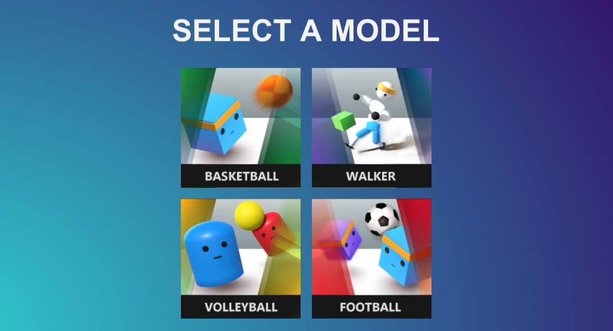
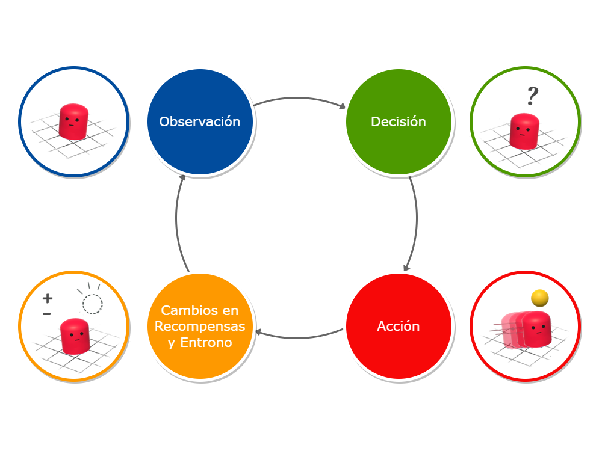
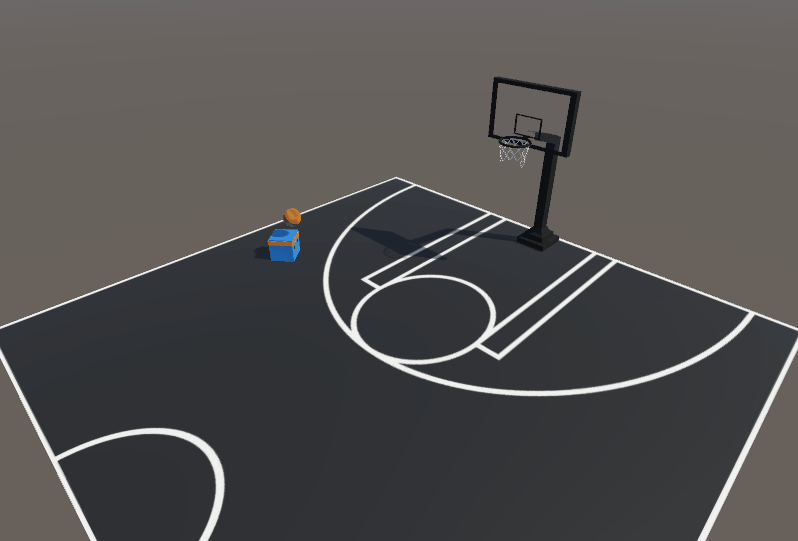
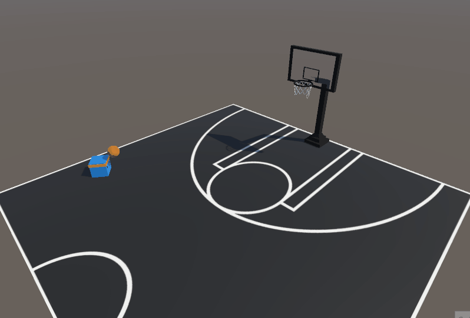
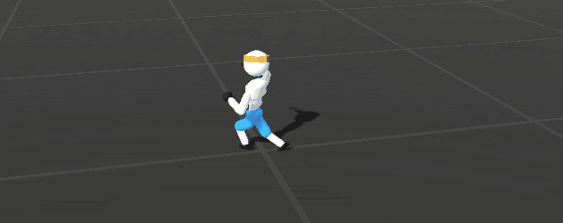
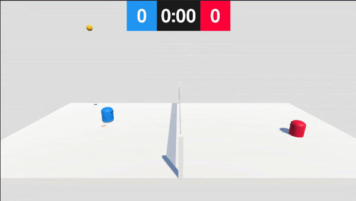
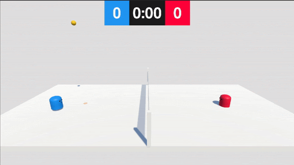
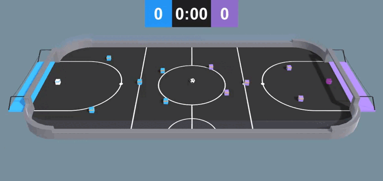
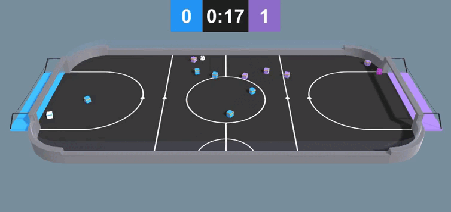
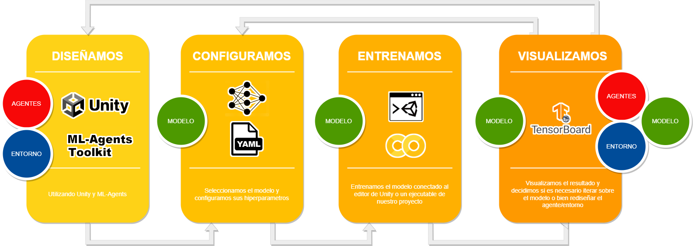

# Trabajo Práctico Grupal - Inteligencia Artificial FIUBA

Proyecto de entrenamiento de modelos de IA con aprendizaje por refuerzo (**Reinforcement Learning**) en Unity. Corresponde a el trabajo práctico grupal de la materia **INTELIGENCIA ARTIFICIAL (95.25)** de la Facultad de Ingeniería de la Universidad de Buenos Aires (**FIUBA**).





## Sobre el proyecto
---


### Introducción
La idea del proyecto era realizar dos ejemplos nuevos de entornos relativamente simples y refinar o mejorar dos de los ejemplos provistos por el equipo de ML-Agents en el toolkit (cuatro ejemplos en total), para intentar abarcar más aspectos del tema pero manteniendolo manejable. Se eligió encararlo de ésta manera debido a que el grupo no tenía experiencia previa en el entorno de Unity, así como tampoco en aprendizaje por refuerzo. 


### Aprendizaje por refuerzo
El aprendizaje por refuerzo es una técnica de enseñanza que implica recompensar los comportamientos positivos y castigar los negativos. 
Consta de un aprendizaje empírico, por lo que el agente informático está en constante búsqueda de aquellas decisiones que le premien y a la par evita aquellos caminos que, por experiencia propia, son penalizados.



### Algunos conceptos:

- **Agente**: La entidad que aprende y toma decisiones.

- **Entorno**: El contexto en el que el agente interactúa y recibe retroalimentación.

- **Observaciones**: Los distintos elementos que componen el entorno. Se corresponden a la capa de entrada de la red neuronal.

- **Acciones**: Las opciones que el agente puede tomar en respuesta a las observaciones del entorno. Corresponde a la capa de salida de la red neuronal.

- **Recompensas**: La retroalimentación positiva o negativa que el agente recibe por sus acciones.


### Básquet

Este es un ejemplo simple creado desde cero en dónde el agente aprende sólo dentro del entorno, es decir, con un set de observaciones y acciones acotado busca meter una pelota de básquet a un aro, es recompensado si lo logra, y también penalizado en ciertas condiciones para lograr el comportamiento deseado más rápidamente.


Inicio             |  Resultado Final
:-------------------------:|:-------------------------:
|<p float=left align="middle"></p>  | <p float=left align="middle"></p>|


### Walker
Nuevamente un ejemplo de agente que aprende sólo en el entorno, en este caso es un ejemplo provisto por el toolkit de Unity ML-Agents el cual buscamos mejorar. El enfoque estuvo en lograr un comportamiento más humano en el caminar del agente, esto fue un proceso iterativo con distintas pruebas para finalmente lograr un resultado satisfactorio.


Inicio             |  Resultado Final
:-------------------------:|:-------------------------:
|<p float=left align="middle"></p>  | <p float=left align="middle"></p>|


### Voley
Este ejemplo también se creo partiendo de cero, con el objetivo de abarcar el entrenamiento de agente vs agente, donde los mismos aprenden jugando entre sí. En el mismo se presentaron diversos problemas a la hora de lograr el comportamiento deseado, los agentes maximizaban sus recompensas explotando situaciones que no se previnieron pero finalmente se logro el resultado esperado con un set de recompensas amplio.


Inicio             |  Resultado Final
:-------------------------:|:-------------------------:
|<p float=left align="middle"></p>  | <p float=left align="middle"></p>|


### Fútbol
Finalmente este ejemplo busca explorar el aprendizaje de agentes vs agentes, es decir por grupos de agentes jugando entre sí en equipo. Nuevamente se trabajó sobre un ejemplo provisto en el toolkit, el mismo constaba de dos equipo de dos agentes. Esto se amplio a seis agentes por equipo y se introdujeron agentes con distintas posiciones en la cancha (por ej: arquero), y por ende distintos comportamientos. El resultado final fue logrado con un set de recompensas complejo en relación a los demás.


Inicio             |  Resultado Final
:-------------------------:|:-------------------------:
|<p float=left align="middle"></p>  | <p float=left align="middle"></p>|


## Framework utilizado
---





### Unity ML-Agents
Para desarrollar el trabajo utilizamos [**ML-Agents**](https://unity-technologies.github.io/ml-agents/), un framework de aprendizaje por refuerzo desarrollado por [Unity Technologies](https://store.unity.com/download) que permite a los desarrolladores de juegos y otros entornos de simulación entrenar agentes de inteligencia artificial (IA) en entornos virtuales.


### TensorBoard
Para la visualización del entrenamiento a lo largo del tiempo usamos **TensorBoard**, el kit de herramientas desarrollado por TensorFlow. Dentro de la aplicación se pueden analizar las estadísticas de entrenamiento como también el cambio de la política de los modelos a lo largo del tiempo. Para correr TensorBoard, usar:

```bash
$ tensorboard --logdir results
```

Donde **results** es la carpeta generada por ML-Agents con los respectivos modelos de redes neuronales.


### PyTorch
**PyTorch** es una biblioteca open source para realizar cómputos usando data flow graphs, la forma fundamental de representar modelos de aprendizaje profundo. Muchos de los modelos del toolkit de **Unity ML-Agents** están implementados sobre esta biblioteca.


## Dependencias

- Python (3.8.13 o superior)
- Unity (2021.3 o posterior)
- Paquete de Unity com.unity.ml-agents
- Paquete de Unity com.unity.ml-agents.extensions


```
$ python -m pip install mlagents==0.30.0
```
```bash
$ pip3 install torch~=1.7.1 -f https://download.pytorch.org/whl/torch_stable.html
```

```bash
$ pip3 install tensorboard
```


## Entrenamiento
---


Con la excepción del ejemplo de Fútbol, el cuál utiliza **MA-POCA** debido a que es aprendizaje en grupos, los demás hacen uso del algoritmo desarrollado por OpenAI, **PPO** (Optimización de Políticas Próximas), el mismo es una técnica que utiliza una red neuronal para aproximar la función ideal que asigna las observaciones de un agente a la mejor acción que un agente puede realizar en un estado determinado. 
Este es un proceso iterativo en el cual entrenamos, visualizamos las métricas del entrenamiento y ajustamos híperparametros acordemente.


### Algunas métricas de interés:


| Variable | Descripción |
| ----------- | ----------- |
| **entropía** | Medida de incertidumbre. Esto corresponde a cuán aleatorias son las decisiones de un agente.|
| **beta** | Corresponde a la fuerza de la regularización de la entropía, lo que hace que la política sea "más aleatoria". Esto asegura que los agentes exploren adecuadamente el espacio de acción durante el entrenamiento.|
| **gamma** | Factor de descuento para recompensas futuras. Esto se puede considerar como qué tan lejos en el futuro el agente debería preocuparse por las posibles recompensas. En situaciones en las que el agente debería estar actuando en el presente para prepararse para las recompensas en un futuro lejano, este valor debería ser grande. En los casos en que las recompensas son más inmediatas, puede ser menor.|
| **epsilon** | Umbral aceptable de divergencia entre la política antigua y la nueva durante la actualización del gradiente descendente. Establecer este valor en un valor pequeño dará como resultado actualizaciones más estables, pero también ralentizará el proceso de capacitación.
| **buffer_size** | Cuántas experiencias (observaciones de agentes, acciones y recompensas obtenidas) se deben recopilar antes de realizar cualquier aprendizaje o actualización del modelo. Un valor muy alto puede perjudicar el entrenamiento |
| **batch_size** | Número de experiencias utilizadas para una iteración de una actualización de descenso de gradiente. Esto siempre debe ser una fracción del **buffer_size** |
| **learning_rate** | Fuerza de cada paso de actualización de descenso de gradiente.|
| **num_layers** | Cuántas capas ocultas están presentes después de la entrada de observación.|
| **hidden_units** | Cuántas unidades hay en cada capa completamente conectada de la red neuronal.|
| **max_steps** | Cuantos pasos de la simulación durará el entrenamiento. Para problemas más complejos se debería subir el número"


### Un ejemplo de archivo:

    behaviors:
      Walker:
        trainer_type: ppo
        hyperparameters:
          batch_size: 2048 // 
          buffer_size: 20480
          learning_rate: 0.0003
          beta: 0.005
          epsilon: 0.2
          lambd: 0.95
          num_epoch: 3
          learning_rate_schedule: linear
        network_settings:
          normalize: true
          hidden_units: 512
          num_layers: 3
          vis_encode_type: simple
        reward_signals:
          extrinsic:
            gamma: 0.995
            strength: 1.0
        keep_checkpoints: 5
        max_steps: 30000000
        time_horizon: 1000
        summary_freq: 30000

Para iniciar una sesión de entrenamiento, solo basta tener abierto en Unity la escena con el agente que se busca entrenar y correr:

    mlagents-learn <path al archivo de configuración> --run-id= <id único del modelo de red neuronal>

Se puede usar los siguientes flags:

- --resume : Reanudar una sesión de entrenamiento para un id dado.
- --force : Sobreescribir un id.
- --initialize-from= : Comenzar una sesión de entrenamiento para un nuevo id a partir de un modelo preentrenado.


## Más información
---


- [Reinforcement Learning](https://huggingface.co/tasks/reinforcement-learning)

- [Example Learning Environments](https://github.com/Unity-Technologies/ml-agents/blob/develop/docs/Learning-Environment-Examples.md)

- [Installation & Set-up](https://github.com/miyamotok0105/unity-ml-agents/blob/master/docs/Installation.md)

- [Training with Proximal Policy Optimization](https://github.com/miyamotok0105/unity-ml-agents/blob/master/docs/Training-PPO.md)

- [Training Configuration File](https://github.com/Unity-Technologies/ml-agents/blob/develop/docs/Training-Configuration-File.md)

- [Training intelligent adversaries using self-play with ML-Agents](https://blog.unity.com/technology/training-intelligent-adversaries-using-self-play-with-ml-agents)

- [Training In Cooperative Multi-Agent Environments with MA-POCA](https://github.com/Unity-Technologies/ml-agents/blob/develop/docs/ML-Agents-Overview.md#training-in-cooperative-multi-agent-environments-with-ma-poca)

- [Using TensorBoard to Observe Training](https://github.com/Unity-Technologies/ml-agents/blob/develop/docs/Using-Tensorboard.md#using-tensorboard-to-observe-training)


## Autores
---


- [Manuel Diéguez](https://github.com/jmdieguez)

- [Tomás Della Vecchia](https://github.com/tomdv18)

- [Santiago Marczewski](https://github.com/smarczewski)

- [Ignacio Montecalvo](https://github.com/imontecalvo)


## Reconocimientos
---


- Se utilizaron como base algunos de los ejemplos provistos en [Unity ML-Agents Toolkit](https://github.com/Unity-Technologies/ml-agents).

- Para el entorno de Básquet se utilizó un versión modificada de [Basketball hoop](https://skfb.ly/oxFvs) de [hotdoghans](https://sketchfab.com/hotdoghans) bajo licencia [CC BY 4.0](https://creativecommons.org/licenses/by/4.0/).

- Para el fondo del menú se utilizó una [imágen](https://unsplash.com/es/fotos/pJadQetzTkI) de [Luke Chesser](https://unsplash.com/@lukechesser?utm_source=unsplash&utm_medium=referral&utm_content=creditCopyText) en [Unsplash](https://unsplash.com/es/fotos/pJadQetzTkI?utm_source=unsplash&utm_medium=referral&utm_content=creditCopyText).
